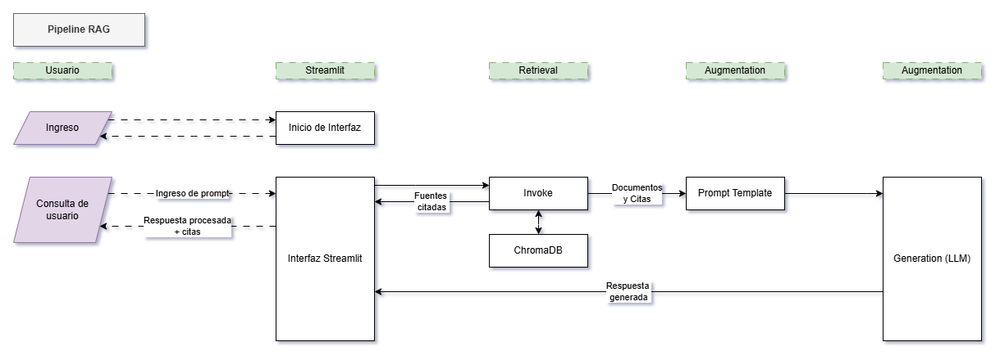

# Trabajo Integrador Nº2 – Sistema RAG para Análisis de Documentos

Este proyecto implementa un sistema **RAG (Retrieval-Augmented Generation)** que permite consultar en lenguaje natural un conjunto de documentos técnicos (PDFs).
El usuario realiza preguntas y el sistema responde utilizando fragmentos reales de los documentos, garantizando trazabilidad mediante la citación de fuentes.

---

## Objetivo del Proyecto

El propósito del sistema es facilitar el análisis de documentación extensa permitiendo:

- Consultar en español cualquier fragmento del corpus.
- Recuperar automáticamente los pasajes más relevantes.
- Generar respuestas contextualizadas mediante LLM (Gemini).
- Mostrar las fuentes utilizadas para garantizar transparencia.

---

## Arquitectura del Sistema RAG

El sistema está dividido en dos fases:

### 🔹 FASE OFFLINE — Preprocesamiento de documentos

1. **Ingesta**
   - Lectura de PDFs desde `data/raw_pdfs/`
   - Extracción de texto
   - Detección de idioma
   - Traducción automática (EN → ES)

2. **Chunking**
   - División en fragmentos de 800 caracteres
   - Overlap de 150 caracteres
   - Almacenamiento en `data/chunks/`

3. **Embeddings + Base Vectorial**
   - Modelo: `sentence-transformers/paraphrase-multilingual-MiniLM-L12-v2`
   - Generación de embeddings con LangChain
   - Persistencia en ChromaDB (`vectorstore/`)
   - Metadata: `source`, `chunk_id`


### 🔹 FASE ONLINE — Respuesta a consultas

1. Embedding de consulta
2. Búsqueda en ChromaDB
3. Selección de top-k chunks relevantes
4. Construcción del prompt (contexto + pregunta)
5. Generación con LLM (Gemini)
6. Visualización + fuentes utilizadas

---

### Diagrama de Flujo


---

## Stack Tecnológico
- **LLM**: Gemini
- **Embeddings**: sentence-transformers/paraphrase-multilingual-MiniLM-L12-v2
- **Vector Database**: ChromaDB
- **Orquestación**: LangChain
- **Interfaz**: Streamlit
- **Deployment**: Hugging Face Spaces

---

## Tecnologías utilizadas

- **Python 3**
- **Streamlit**
- **LangChain**
- **ChromaDB**
- **Sentence Transformers**
- **Google Gemini**
- **HuggingFace Inference API**
- **PyPDF**
- **python-dotenv**
- **langdetect**

---

## Estructura del proyecto

```
.
├─ src/
│  ├─ config.py
│  ├─ ingest.py
│  ├─ llm.py
│  └─ vecstore.py
│
├─ web/
│  └─ streamlit_app.py
│
├─ data/
│  ├─ raw_pdfs/
│  ├─ texts/
│  └─ chunks/
│
├─ vectorstore/
├─ requirements.txt
└─ README.md
```

---

## Archivo `.env`

El archivo `.env` debe colocarse en la **raíz del proyecto** y contener:

```
HF_API_KEY=TU_API_KEY_DE_HUGGINGFACE
GEMINI_API_KEY=TU_API_KEY_DE_GEMINI
```

> `python-dotenv` lo carga automáticamente.  
> Este archivo **no debe subirse al repositorio**.

---

## Instalación y Ejecución

### 1️⃣ Clonar el repositorio

```
git clone https://github.com/gimb99/PDH_INTEGRADOR_GRUPAL_X.git
cd PDH_INTEGRADOR_GRUPAL_X
git checkout <rama-deseada> #develop2
```

### 2️⃣ Crear y activar entorno virtual

```
py -m venv .venv
.venv\Scripts\activate
```

Linux/Mac:

```
source .venv/bin/activate
```

### 3️⃣ Copiar `.env` a la raíz del proyecto

### 4️⃣ Instalar dependencias

```
py -m pip install -r requirements.txt
```

### 5️⃣ Colocar los PDFs en:

```
data/raw_pdfs/
```

### 6️⃣ Ejecutar la ingesta (FASE OFFLINE)

Desde la raíz del proyecto:

```
py -m src.ingest
```

### 7️⃣ Ejecutar la aplicación (FASE ONLINE)

```
py -m streamlit run web/streamlit_app.py
```

Abrir (si no se abre automáticamente):

```
http://localhost:8501
```

---

## Uso del sistema

1. Escribir una pregunta en español.
2. Presionar **“Consultar”**.
3. El sistema devuelve:
   - La respuesta generada por Gemini
   - Los fragmentos utilizados (documento + chunk)

---

## Ejemplos de consultas

- “¿Cuál es el procedimiento del relevamiento de campo para la selección de un desemulsionante?”
- “¿Qué riesgos operativos se mencionan?”
- “Explicame qué es una Política de CMASS según los documentos.”

---

## Decisiones de diseño

- ChromaDB como vector store persistente
- Modelo multilingüe para soportar documentos en EN/ES
- Separación clara OFFLINE/ONLINE
- Traducción para unificar el corpus
- Interfaz simple vía Streamlit
- Gemini por rendimiento y velocidad

---

## Limitaciones

- No mantiene memoria conversacional
- Calidad dependiente del corpus
- Traducción automática puede introducir pequeñas variaciones

---

## Cumplimiento de requisitos:

- ✔ Pipeline RAG completo
- ✔ Base vectorial persistente (Chroma)
- ✔ Uso de LangChain (embeddings, retrieval, chunking)
- ✔ LLM integrado (Gemini)
- ✔ Interfaz Streamlit funcional
- ✔ Corpus real de documentos
- ✔ Ejecución local reproducible
- ✔ Documentación completa

---

## Información
- Trabajo Integrador Grupal
- Integrantes: Gonzalo Barthou, Carmen Marylin Rodriguez, Tamara Peña
- Materia: Técnicas de Procesamiento del Habla
- Institución: IFTS 24
- Año: 2025